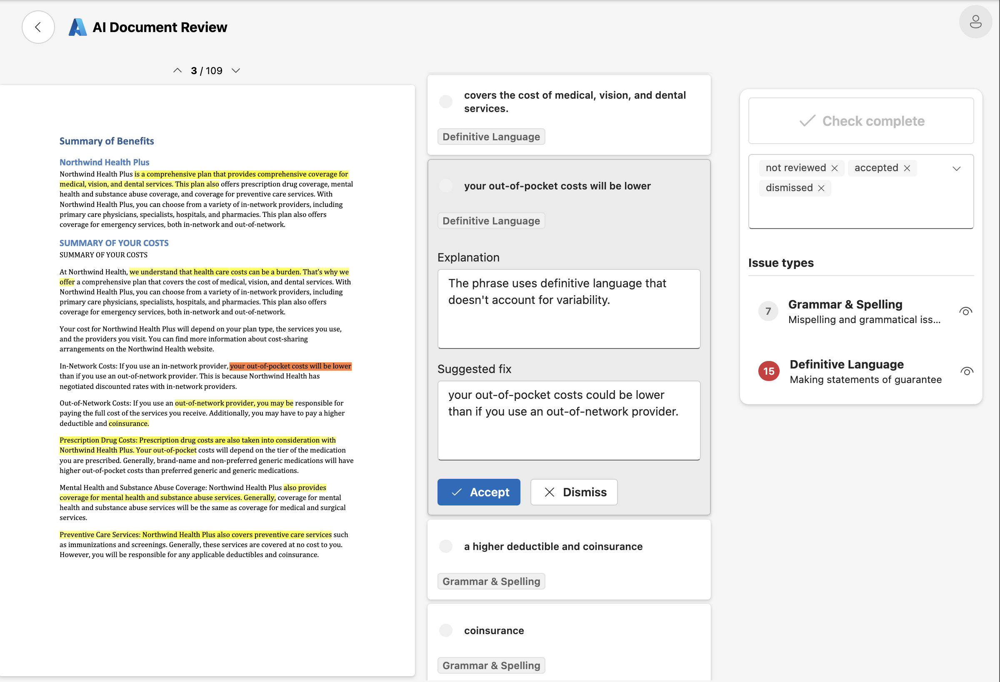
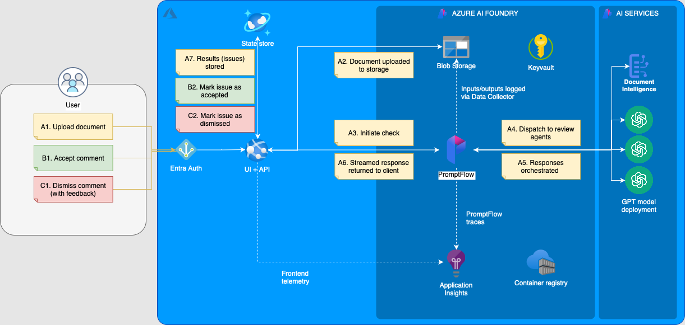

# AI Document Review

The _AI Document Review_ Solution Accelerator is a powerful and customizable solution that brings together the latest AI agentic patterns and services to enhance the review process for documents across various domains where compliance and accuracy of content is critical. Whether it's legal, regulatory, technical, or other types of content, users can define specific "review agents" through guideline prompts to determine what issues Large Language Models (LLMs) should look for, making the tool adaptable to a wide range of use cases and an ideal place to start for teams looking to streamline their document review processes using AI.

Built on Azure AI Foundry, Azure AI Services (including Document Intelligence and Azure OpenAI models) and integrated with Azure Storage and Azure Cosmos DB, the accelerator demonstrates a robust design for ingesting documents, extracting text, identifying issues using AI agents, and displaying the results to users in a web UI, and provides a pattern for feedback collection, evaluation and continual prompt improvement, all of which can be built upon for your own production use cases.

### How It Works

1. **Upload PDF Documents**: Users provide PDF files through the web interface.
1. **Define Domains via AI Prompts**: Users can either choose from a set of pre-configured example prompts or create their own custom prompts for specific document domains (e.g., legal, technical).
1. **Automated Text Extraction**: Document Intelligence extracts the text content from the document.
1. **AI Analysis**: The application uses the provided AI guideline prompts to identify issues within the document.
1. **Actionable Feedback**: Users receive a list of issues with explanations and suggestions for addressing them.
1. **Interactive Review**: Issues can be accepted or dismissed by the user within the web application, and feedback can be provided on each dismissed issue to improve the agents' prompts over time.

### Key Features

- **Customizable AI Agents**: Define domain-specific AI prompts to tailor the analysis to any type of document content.
- **AI-Powered Text Extraction and Analysis**: Leverages Document Intelligence for advanced text extraction including OCR (text within image) support.
- **Interactive Feedback**: Easy-to-use interface that allows users to upload documents, view previously reviewed documents, initiate new reviews and interact with the results.
- **Secure and Scalable**: Built to handle documents with strict security requirements, including utilising private networking through [Network Security Perimeters](https://learn.microsoft.com/en-us/azure/private-link/network-security-perimeter-concepts) and securing resource access through service and user identities using Entra.
- **Example Prompts**: A set of pre-configured domain prompts is included to get you started quickly.
- **Feedback Loop**: Built-in mechanisms to collect feedback on the AI agents' performance, evaluate the effectiveness of your prompts to improve the quality of the review process over time.
- **CI/CD**: Automated deployment pipelines out of the box for the application and infrastructure using GitHub Actions and Terraform.

### Architecture

View the full component list and architecture details in the [Architecture page](./docs/architecture.md).

## Getting Started

Please see the [Getting Started](./docs/getting_started.md) guide for detailed instructions on setting up your development environment and deploying the solution.

## What Next?

### Customize the AI Agents

Define your own prompts to tailor the analysis to your specific document content.

- Review the [LLM App](./docs/promptflow/llm_app.md) documentation for more information on how to create and manage new agents and their prompts.

### Evaluate & improve your prompts

Implement a feedback loop to collect feedback on the AI agents' performance from your users and improve the quality of the review process over time.

- Review the [LLM Ops](./docs/llm_ops.md) guide for ideas on how to collect and evaluate feedback and monitor the performance of your prompts.

### Integrate with Your Systems

Extend the solution to integrate with your existing systems and workflows. For example, you could integrate with a document management system to automatically load and process new documents, and post accepted review comments from the AI agents.

## Contributing

This project welcomes contributions and suggestions. Most contributions require
you to agree to a Contributor License Agreement (CLA) declaring that you have
the right to, and actually do, grant us the rights to use your contribution. For
details, visit https://cla.opensource.microsoft.com.

When you submit a pull request, a CLA bot will automatically determine whether
you need to provide a CLA and decorate the PR appropriately (e.g., status check,
comment). Simply follow the instructions provided by the bot. You will only need
to do this once across all repos using our CLA.

This project has adopted the
[Microsoft Open Source Code of Conduct](https://opensource.microsoft.com/codeofconduct/).
For more information see the
[Code of Conduct FAQ](https://opensource.microsoft.com/codeofconduct/faq/) or
contact [opencode@microsoft.com](mailto:opencode@microsoft.com) with any
additional questions or comments.

## Trademarks

This project may contain trademarks or logos for projects, products, or
services. Authorized use of Microsoft trademarks or logos is subject to and must
follow
[Microsoft's Trademark & Brand Guidelines](https://www.microsoft.com/en-us/legal/intellectualproperty/trademarks/usage/general).
Use of Microsoft trademarks or logos in modified versions of this project must
not cause confusion or imply Microsoft sponsorship. Any use of third-party
trademarks or logos are subject to those third-party's policies.
